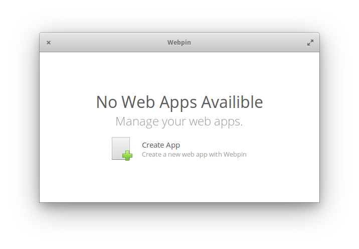
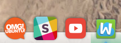

<div>
    <h1 align="center">Webpin</h1>
    <h3 align="center"><br>A simple app to pin websites on the desktop</h3>
    <p align="center">Designed for <a href="https://elementary.io">elementary OS</p>
</div>

[](https://travis-ci.org/artemanufrij/webpin)

### Donate
<a href="https://www.paypal.me/ArtemAnufrij">PayPal</a> | <a href="https://liberapay.com/Artem/donate">LiberaPay</a> | <a href="https://www.patreon.com/ArtemAnufrij">Patreon</a>

<p align="center">
  <a href="https://appcenter.elementary.io/com.github.artemanufrij.webpin">
    
  </a>
</p>
<p align="center">
  
  </br>
    Pin your any favourite website on Applications Menu or Plank like a regular desktop app
  </br></br>
  
</p>


## Install from Github.

As first you need elementary SDK
```
sudo apt install elementary-sdk
```

Install dependencies
```
sudo apt install libwebkit2gtk-4.0-dev
```

Clone repository and change directory
```
git clone https://github.com/artemanufrij/webpin.git
cd webpin
```

Create **build** folder, compile and start application
```
mkdir build
cd build
cmake -DCMAKE_INSTALL_PREFIX=/usr ..
make
```

Install and start Webpin on your system
```
sudo make install
com.github.artemanufrij.webpin
